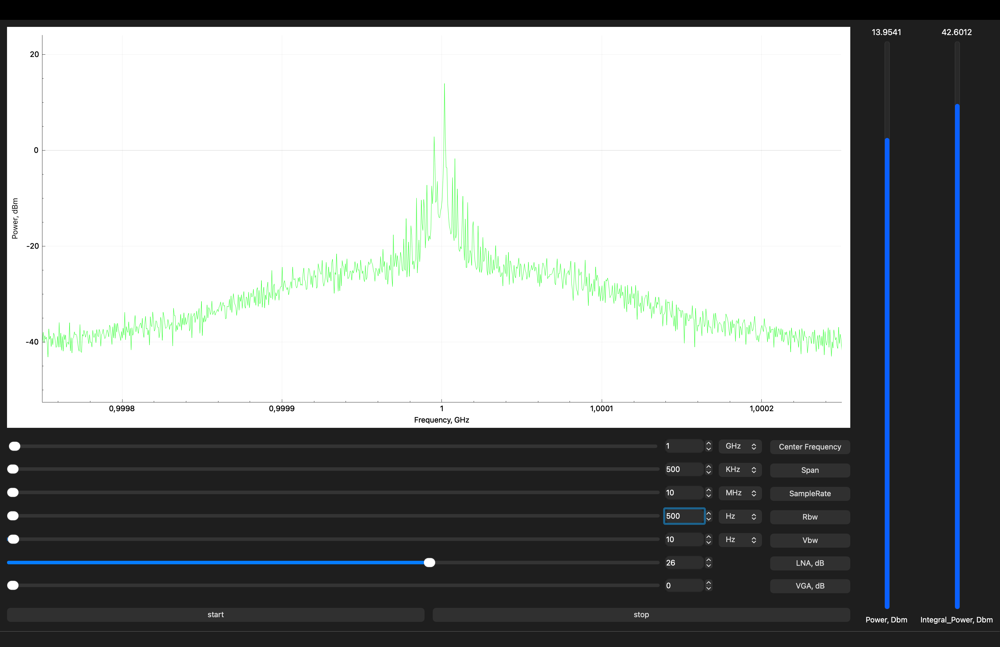

# HackRFSpectrumAnalyzer

C++/Qt desktop spectrum analyzer for HackRF SDR devices with real-time FFT processing and spectrum visualization.



## Overview

**HackRFSpectrumAnalyzer** is a desktop application for working with HackRF SDR devices.
The application connects to a HackRF device, receives IQ samples, performs FFT-based spectrum calculation and displays the result in real time using a Qt Widgets interface.

The project demonstrates practical C++/Qt development for hardware-oriented software: device initialization, callback-based data receiving, signal processing, GUI controls and real-time plotting.

## Features

* HackRF device initialization and configuration
* Real-time IQ sample receiving through `libhackrf`
* FFT-based spectrum calculation using `FFTW3`
* Spectrum visualization with `QCustomPlot`
* Center frequency, span, RBW/VBW and gain settings
* Power calculation and frequency axis scaling
* Qt Widgets-based desktop interface
* Basic UI demonstration without a connected HackRF device

## Tech Stack

* C++17
* Qt Widgets
* Qt Core
* QCustomPlot
* libhackrf
* FFTW3
* libusb
* qmake
* Linux / Unix-like systems

## Architecture

The project is divided into two main layers:

* `HackRFDevice` — encapsulates HackRF initialization, parameter setup, RX callback handling, IQ sample processing, FFT calculation and spectrum data preparation.
* `MainWindow` — provides GUI controls, connects user actions with the device layer and updates the spectrum plot.

General data flow:

```text
HackRF SDR device
        ↓
libhackrf RX callback
        ↓
IQ sample buffer
        ↓
FFT processing
        ↓
Spectrum / power calculation
        ↓
Qt signal
        ↓
QCustomPlot visualization
```

## Repository Structure

```text
.
├── docs/images/              # Screenshots and project images
├── qcustomplot/              # QCustomPlot sources
├── hackrfdevice.cpp/.h       # HackRF device interaction and DSP logic
├── mainwindow.cpp/.h/.ui     # Qt Widgets GUI
├── main.cpp                  # Application entry point
├── hackRF.pro                # qmake project file
└── README.md
```

## Dependencies

Required dependencies:

* Qt 5 or Qt 6
* libhackrf
* FFTW3
* libusb-1.0
* pkg-config

### Ubuntu / Debian

```bash
sudo apt update
sudo apt install qtbase5-dev qtbase5-dev-tools libhackrf-dev hackrf libfftw3-dev libusb-1.0-0-dev pkg-config
```

### macOS

```bash
brew install qt hackrf fftw libusb pkg-config
```

If Qt is installed through Homebrew, make sure that `qmake` is available in your `PATH`.

## Build

Clone the repository:

```bash
git clone https://github.com/Unsainted38/HackRFSpectrumAnalyzer.git
cd HackRFSpectrumAnalyzer
```

Build with qmake:

```bash
qmake hackRF.pro
make
```

Run the application:

```bash
./hackRF
```

The exact binary name may depend on the qmake target and build directory used by your environment.

## Running Without Hardware

The GUI can be opened for interface demonstration without a connected HackRF device.
Real spectrum acquisition and hardware testing require a HackRF SDR device connected to the system.

If the application cannot access the device, check that HackRF is detected:

```bash
hackrf_info
```

On Linux, USB permissions may also need to be configured for non-root access.

## What I Implemented

* Designed and implemented the Qt Widgets GUI for spectrum analyzer control.
* Implemented HackRF initialization and configuration through `libhackrf`.
* Implemented real-time IQ data receiving using the `libhackrf` callback model.
* Added FFT-based spectrum calculation using `FFTW3`.
* Implemented spectrum plotting and frequency axis scaling with `QCustomPlot`.
* Added basic power calculation and real-time graph updates.
* Structured the application into a device-processing layer and a GUI layer.

## Known Limitations

* The project currently uses qmake.
* CMake support is planned.
* Hardware acquisition requires a connected HackRF SDR device.
* Some platform-specific dependency installation may require manual setup.
* The project is intended as a desktop engineering tool and portfolio example, not as a full replacement for professional SDR software.

## Possible Improvements

* Add CMake build support.
* Add a mock signal generator for full demo mode without hardware.
* Improve error handling and user-facing diagnostics.
* Add configuration file support for default device parameters.
* Add export of spectrum data to CSV.
* Add GitHub Actions build check.
* Add release builds for Linux.

## Project Purpose

This project was developed as a practical C++/Qt application for SDR-based spectrum analysis and hardware interaction.
It demonstrates experience with desktop GUI development, device APIs, callback-based data processing, FFT calculations and real-time visualization.
